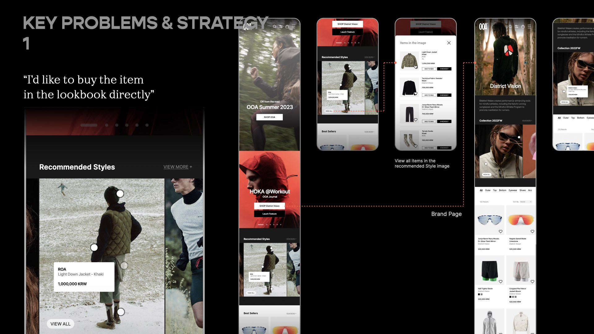
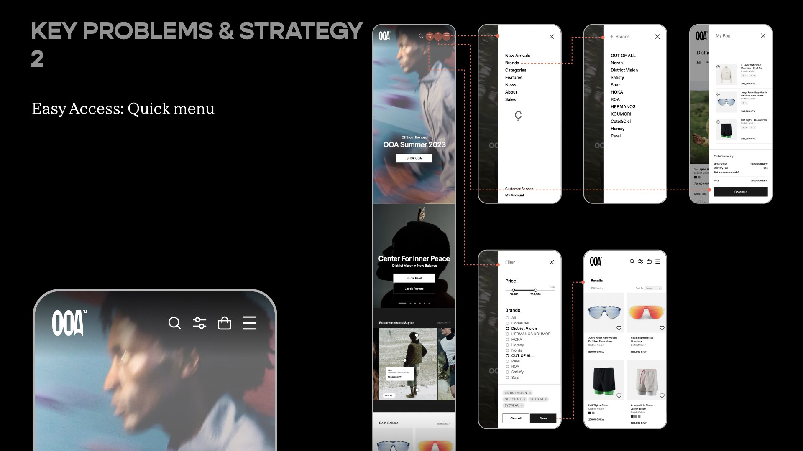
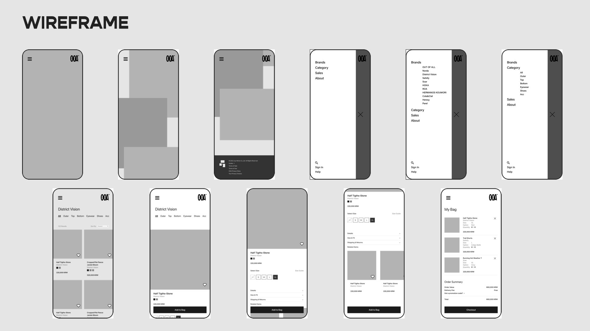

# OOA Website - Work In Progress (WIP)

OOA(OUT OF ALL) is a new e-commerce platform specializing in outdoor wear, launched by Joy Works, which also operates HOKA Korea.

This web development project focuses on seamlessly merging offline and online shopping experiences. It curates a diverse range of outdoor styles and lifestyle content, tackling challenges like booking limited editions, browsing personalized content, and streamlining payments. The aim is to improve the shopping experience for users, employees, and stores, positioning OOA as a leader in the outdoor lifestyle market.


## Table of contents

- [Overview](#overview)

  - [Screenshot](#screenshot)
  - [Goal](#goal)
  - [Links](#links)

- [My process](#my-process)

  - [Planning](#planning)
    - [Basic interaction planning](#basic-interaction-planning)
    - [Technical planning](#technical-planning)

- [Challenges and Lessons](#challenges-and-lessons)

  - [1. React environment without CRA](#1-react-environment-without-cracreate-react-app)

- [Future Improvements](#future-improvements)
- [Useful resources](#useful-resources)
- [Author](#author)
- [Acknowledgments](#acknowledgments)

## Overview

- This project began as a client request, and I am now recreating it as a new version to practice React.
- This project serves as an exercise to deepen familiarity with React and object-oriented programming (OOP).
- The project is designed as a web application.

### Goal

- User types: (A) Admins / (L) Logged-in user / (V) Visitors

Users should be able to:

**Must have**

General

- [ ] See all products on the main homepage (A, L, V)
- [ ] See all product details (A, L, V)
  - [ ] Add to bag button (A, L)
- [ ] LocalStorage

SignUp & Bag(cart)

- [ ] Login/Logout/SignUp (A, L, V)
- [ ] Bag (A, L)
  - [ ] Add products in a cart

Add & Edit(A)

- [ ] Add new product data
- [ ] Edit existing product data

**Good to have**

- [ ] Search for a keyword
- [ ] Toggle the color scheme between light and dark mode

### Links

- gitHub URL: [Noej Ijkus](https://github.com/ijkuS)
- Live Site URL:

## My process

### Planning

#### App UX/UI Planning

UX/UI Strategy





```
* large screen UI
-    header / navbar
     -   Logo
     -   Bag
     -   SignUp(Login/Logout)
     -   User info (profile icon + name)

     -   New Arrivals
     -   Products
     -   Brands
     -   Sales
-    main
     -    list of products
-    footer
     -    brand and website information

* mobile UI

-    header / navbar
     -   Logo
     -   Quick Menu
         -     Search
         -     Bag
         -     Hamburger icon
               -     New Arrivals
               -     Brands
               -     Categories
               -     Features
               -     News
               -     About
               -     Sales

               -     Customer service
               -     My Account

-    main
     -    list of products
-    footer
     -    brand and website information
```

#### Basic interaction planning

- Site URL structure

```
   - /   -> <home>
   - /products   -> <AllProducts>
   - /products/addnew -> <AddProducts> for admins
   - /products/:id -> <ProductDetail>
   - /carts -> <Cart>
```

- Navbar + Outlet structure (with React router)
  - routes folder -> Root.jsx
  - pages folder

```

```

```
-    Click products button

-    Click Login button
      → popup input window (dialog)

```

#### Technical planning

- Semantic HTML5 markup
- CSS custom properties
- Mobile-first workflow
- [React](https://react.dev/)
- [JavaScript](https://developer.mozilla.org/en-US/docs/Web/JavaScript)

## Challenges and Lessons

### 1. React environment without CRA(Create-React-App)

I build React environment setting without CRA to understand how each library and file work.

To read more, please check the file [**README-setting**](./README-setting.md)

### 2. File structure setting

Details: [Basic interaction planning](#basic-interaction-planning)

### SVG icon transformation

- Select the desired icon from the React-Icons site, then open developer tools to save the SVG portion.
- Search "SVG to ICO" or "PNG to ICO" on Google.
- Use one of the sites to convert the file to ICO format and save it.
- If it's an SVG file, you can modify the code to set or change the color as needed.

## Future Improvements

## Useful resources

**Design References**

- [Google design guidelines for developers](https://developers.google.com/assistant/interactivecanvas/design)
- [Google Material 3](https://m3.material.io/)
- [CSS Box shadow examples](https://getcssscan.com/css-box-shadow-examples)

- [Google color palette](https://partnermarketinghub.withgoogle.com/brands/google-news/visual-identity/color-palette/)
- [TailwindCSS color palette](https://tailwindcss.com/docs/customizing-colors)
- [material ui](https://materialui.co/colors)

**VSC Tips**

- [Multi selections](https://code.visualstudio.com/docs/editor/codebasics)

**Git Tips**

- [Terminal markdown](https://github.com/Evoniuk/terminal-markdown)

## Author

- [Noej Ijkus](https://github.com/ijkuS)
- [email](ijkus.noej@gmail.com)

## Acknowledgments
