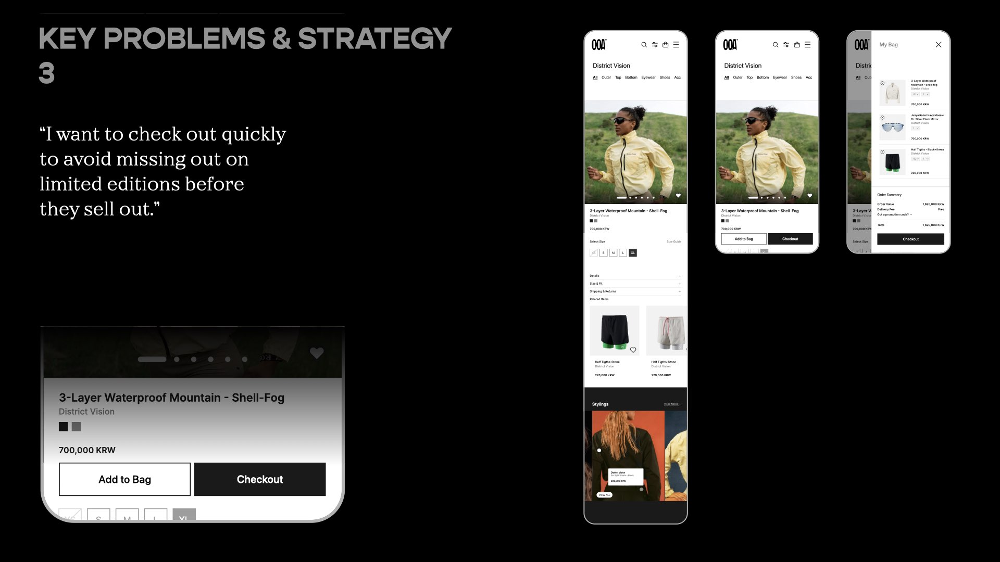

# OOA Website - Work In Progress (WIP)

OOA is a new e-commerce platform specializing in outdoor wear, launched by Joy Works, which also operates HOKA Korea.

This web development project focuses on seamlessly merging offline and online shopping experiences. It curates a diverse range of outdoor styles and lifestyle content, tackling challenges like booking limited editions, browsing personalized content, and streamlining payments. The aim is to improve the shopping experience for users, employees, and stores, positioning OOA as a leader in the outdoor lifestyle market.


## Table of contents

-   [Overview](#overview)

    -   [Screenshot](#screenshot)
    -   [Goal](#goal)
    -   [Links](#links)

-   [My process](#my-process)

    -   [Planning](#planning)
        -   [App UX/UI planning](#app-uxui-planning)
        -   [Basic interaction planning](#basic-interaction-planning)
        -   [Technical planning](#technical-planning)

-   [Challenges and Lessons](#challenges-and-lessons)

    -   [1. React environment without CRA](#1-react-environment-without-cracreate-react-app)
    -   [2. File structure setting](#2-file-structure-setting)
    -   [3. Skeleton of application (Navbar + Outlet)](#3-skeleton-of-application-navbar--outlet)

    -   [git Tips: Delete a file from a Git repository](#git-tips-delete-a-file-from-a-git-repository)
    -   [SVG icon transformation](#svg-icon-transformation)

-   [Future Improvements](#future-improvements)
-   [Useful resources](#useful-resources)
-   [Author](#author)
-   [Acknowledgments](#acknowledgments)

## Overview

-   This project began as a client request, and I am now recreating it as a new version to practice React.
-   This project serves as an exercise to deepen familiarity with React and object-oriented programming (OOP).
-   The project is designed as a web application.

### Goal

-   User types: (A) Admins / (L) Logged-in user / (V) Visitors

Users should be able to:

**Must have**

General

-   [ ] See all products on the main homepage (A, L, V)
-   [ ] See all product details (A, L, V)
    -   [ ] Add to bag button (A, L)
-   [ ] LocalStorage

SignUp & Bag(cart)

-   [ ] Login/Logout/SignUp (A, L, V)
-   [ ] Bag (A, L)
    -   [ ] Add products in a cart

Add & Edit(A)

-   [ ] Add new product data
-   [ ] Edit existing product data

**Good to have**

-   [ ] Search for a keyword
-   [ ] Toggle the color scheme between light and dark mode

### Links

-   gitHub URL: [Noej Ijkus](https://github.com/ijkuS)
-   Live Site URL:

## My process

### Planning

#### App UX/UI Planning

UX/UI Strategy





**Large screen UI**

-   Landing page

```
-    header (navbar)
     -   Logo -> onclick: homepage

     -   New Arrivals
     -   Products
     -   Brands
     -   Sales

     -   Edit -> onclick: /products/addNew -- (A only)
     -   Bag -> onclick: /cart -- (A, L)
     -   User info (profile icon + name) -- (A, L)
     -   SignUp(Login/Logout)

-    main (Outlet part)
     -   banners or movieclips
     -   product card grid layout

-    footer
     -    brand and website information
```

-   Detail page

for logged-in users and visitors

```
-    Outlet part
     -   left: product images
     -   right:
         -  product name
         -  category
         -  price
         -  description
         -  option buttons
         -  decalaimer
         -  button: Add to bag

-    footer
     -    brand and website information
```

-   Add new product / Edit existing product

for admins

```
-    Outlet part
     -   left: multiple image preview of chosen file
     -   right:
         -  input: choose files (multiple files)
         -  input: product name
         -  input: price
         -  input: Category
         -  input: Description
         -  input: Options(separted by commas) / or set a dropdown menu
         -  button: Click to Upload
```

**Mobile UI**

```
* mobile UI

-    header / navbar
     -   Logo
     -   Quick Menu
         -     Search
         -     Bag
         -     Hamburger icon
               -     New Arrivals
               -     Brands
               -     Categories
               -     Features
               -     News
               -     About
               -     Sales

               -     Customer service
               -     My Account

-    main
     -    list of products
-    footer
     -    brand and website information
```

#### Basic interaction planning

-   Site URL structure

```
   - /   -> <home>
   - /products   -> <AllProducts>
   - /products/addnew -> <AddProducts> for admins
   - /products/:id -> <ProductDetail>
   - /carts -> <Cart>
```

-   Navbar + Outlet structure (with [React router DOM](https://reactrouter.com/en/main/start/overview))
    -   routes folder -> Root.jsx
    -   pages folder

```

```

```
-    Click products button

-    Click Login button
      → popup input window (dialog)

```

#### Technical planning

-   Semantic HTML5 markup
-   CSS custom properties
-   Mobile-first workflow
-   [React](https://react.dev/)
-   [JavaScript](https://developer.mozilla.org/en-US/docs/Web/JavaScript)
-   [TypeScript]

-   [Tanstack Router](https://tanstack.com/router/latest)
-   [React Router DOM](https://www.npmjs.com/package/react-router-dom)
-   [React Router](https://reactrouter.com/en/main)
-   Firebase
    -   authentification
    -   database

## Challenges and Lessons

### 1. React environment without CRA(Create-React-App)

I build React environment setting without CRA to understand how each library and file work. To read more, please check the file [**README-setting**](./README-setting.md)

### 2. File structure setting

Details: [Basic interaction planning](#basic-interaction-planning)

### 3. Skeleton of application (Navbar + Outlet)

-   Install React router dom for using 'Navbar + Outlet' structure

```shell
   npm i react-router-dom
```

-   Initial page structure and file tree

```
    src
    ┣ components
    ┃ ┗ Navbar.tsx
    ┣ pages
    ┃ ┣ AddNewPage.tsx
    ┃ ┣ AllProducts.tsx
    ┃ ┣ Cart.tsx
    ┃ ┣ NotFound.tsx
    ┃ ┗ ProductDetail.tsx
    ┣ routes
    ┃ ┗ Root.tsx
    ┣ styles
    ┃ ┗ style.css
    ┣ App.tsx
    ┗ index.tsx
```

### git Tips: Delete a file from a Git repository

[Reference](https://sentry.io/answers/delete-a-file-from-a-git-repository/)

case: Remove a file or folder on the remote only

```shell
   git rm --cached unwanted-file.txt
   git commit -m "remove unnecessary files"
   git push origin main

```

case: Remove a file or folder from the local

```shell
   git rm unwanted-file.txt
   git commit -m "remove unnecessary files"
   git push origin main

```

### SVG icon transformation

-   Select the desired icon from the React-Icons site, then open developer tools to save the SVG portion.
-   Search "SVG to ICO" or "PNG to ICO" on Google.
-   Use one of the sites to convert the file to ICO format and save it.
-   If it's an SVG file, you can modify the code to set or change the color as needed.

## Future Improvements

## Useful resources

**Design References**

-   [Google design guidelines for developers](https://developers.google.com/assistant/interactivecanvas/design)
-   [Google Material 3](https://m3.material.io/)
-   [CSS Box shadow examples](https://getcssscan.com/css-box-shadow-examples)

-   [Google color palette](https://partnermarketinghub.withgoogle.com/brands/google-news/visual-identity/color-palette/)
-   [TailwindCSS color palette](https://tailwindcss.com/docs/customizing-colors)
-   [material ui](https://materialui.co/colors)

**VSC Tips**

-   [Multi selections](https://code.visualstudio.com/docs/editor/codebasics)
-   VSC, Global code snippets: command palette -> snippet -> Global code snippets

command palette -> snippet -> Global code snippets
snippets.code-snippets

```json
{
    "reactFunction": {
        "prefix": "rfc",
        "body": "import React from 'react';\n\nexport default function ${1:${TM_FILENAME_BASE}}() {\n\treturn (\n\t\t<div>\n\t\t\t\n\t\t</div>\n\t);\n}\n\n",
        "description": "Creates a React Function component"
    },
    "reactStatelessImplicitReturn": {
        "prefix": "rsi",
        "body": "import React from 'react';\n\nexport const ${1:${TM_FILENAME_BASE}} = (props) => (\n\t\t\t$0\n\t);",
        "description": "Creates a React Function component"
    },
    "Import Module CSS": {
        "prefix": "si",
        "body": ["import styles from './$TM_FILENAME_BASE.module.css'"],
        "description": "Import PostCSS"
    },
    "ClassName": {
        "prefix": "cn",
        "body": ["className="],
        "description": "Adding className"
    }
    // "ClassName": {
    //     "prefix": "cn",
    //     "body": ["className={styles.$1}"],
    //     "description": "Adding className"
    // }
}
```

**Git Tips**

-   [Terminal markdown](https://github.com/Evoniuk/terminal-markdown)

## Author

-   [Noej Ijkus](https://github.com/ijkuS)
-   [email](ijkus.noej@gmail.com)

## Acknowledgments
